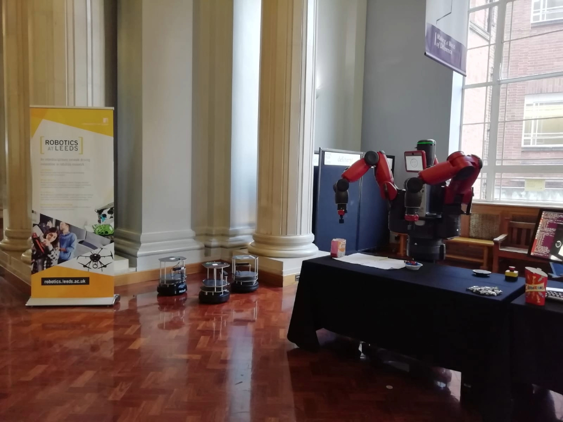

The network was invited to the University Technical College (UTC) to present the robotics research in the University of Leeds, for the UTC Robotics Week. Four speakers from the network presented the different fields of research to the UTC students. Participants more than 30 people per speaker.

Additionally we ran a workshop based around the lego mindstorm systems. Through the workshop we hoped to encourage problem solving while introducing the students to basic electronics and coding concepts.

{:.lead width="960" height="540" loading="lazy"}